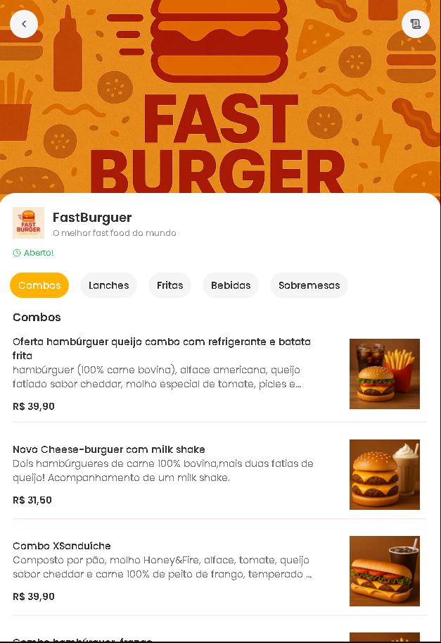

Um sistema completo para pedidos online de um restaurante,

com cardápio sonoro, carrinho de compras e checkout integrado.

Ideal para delivery de pizza, lanches ou qualquer outro tipo de comida.

Funcionalidades

Layout responsivo (primeiro para dispositivos móveis)

Catálogo de produtos (pizzas, lanches, bebidas etc.)

Carrinho de compras com resumo do pedido

Tela de checkout

Painel de gerenciamento de pedidos (admin)

Tecnologias Utilizadas

TypeScript | Next.js

CSS do Tailwind

Prisma